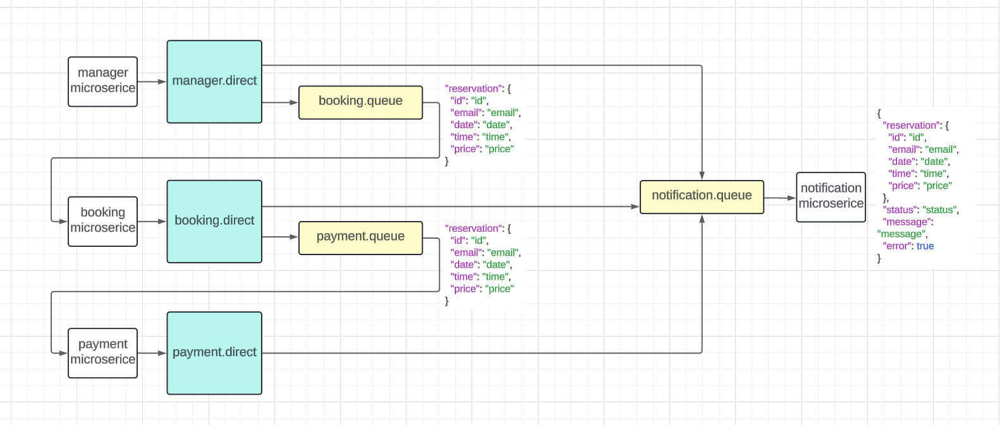

# Ticket Booking
Spring Boot projects. Four microservice are interconnected using message broker - RabbitMQ.

### Manager
Manager - a primitive web interface for registering a ticket. He sends a message to the "Notification" and "Booking" queues for further booking.
The project is built on: Spring Web MVC, Thymeleaf and Spring AMQP.
Used: lombok, mapstruct, jackson, bootstrap, RabbitMQ.

### Booking
Booking - microservice for booking a ticket, saves information in the database. He listens to the "Booking" queue
and sends messages to "Notification" and "Payment".
The project is built on: Spring Data JPA and Spring AMQP. 
Used: Lombok, Mapstruct, Jackson, PostgreSQL, RabbitMQ.

### Payment
Payment - a microservice to simulate a ticket payment. He listens to the "Payment" queue and sends a message to the "Notification". 
The Project is Built on: Spring AMQP. 
Used: Lombok, Mapstruct, Jackson, Rabbitmq.

### Notification
Notification - microservice for sending notifications of reservation status. Sends email notifications. Lists the queue "Notification". 
The Project is Built on: Spring AMQP, Jakarta Mail. 
Used: Lombok, Mapstruct, Jackson, Rabbitmq.

